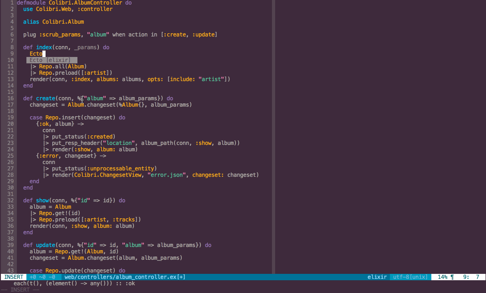

# NvimRplugin: Elixir Contextual (really) completion and doc


thanks @archSeer for the gif !

# Features

- Load nearest mix project in current file path with `:MixLoad`
- Start the current mix project application inside your vim: `:MixStart`
- Add a complete function "ElixirComplete": iex completion and doc into vim
- Interpret the currently selected Elixir Code with `:ElixirExec`
- If no line selected, then the whole file is interpreted, useful to dynamically reload current file modules when the app runs with `:MixStart`
- Bindings are kept along interpretations
- You can reset binding using the bang: `:ElixirExec!`
- Add a function `ExdocGetBody` to get documentation under cursor
- Add a command `:ElixirBuildenv` which parse the current buffer to
  maintain a map of line-> `__ENV__`, once this command is executed,
  then the completion and the documentation function will understand
  the context: aliases, imports, use, etc., this function compile the
  file and use your CPU, use automd on vim to execute it when you want.
- The `:ElixirBuildenv` background compilation can trigger error
  highlighting and log into vim to help your debugging.

# Installation

Use directly the nvim packages https://github.com/awetzel/elixir.nvim
which includes this plugin.

Otherwise install neovim elixir host (see https://github.com/awetzel/neovim-elixir)
then compile your plugin as an archive and put the archive in the
`rplugin/elixir` directory of your neovim configuration.

```bash
mix archive.build
cp nvim_rplugin-0.0.1.ez ~/.config/nvim/rplugin/elixir/
```

# Configuration

Four possible configurations:

- `g:elixir_maxmenu` is an integer giving the max length of the function doc
  preview in omni completion, default to 70
- `g:elixir_docpreview` is a boolean (int 0 or 1) to choose if you
  want the completion function to open doc in preview window or not,
  default to 0.
- `g:elixir_showerror` is a boolean (int 0 or 1) to choose if you
  want the highlight the errorneous line and log the error into vim
  during `:ElixirBuildenv` compilation.
- `g:elixir_gotoerror` is a boolean (int 0 or 1) to choose if you
  want the vim cursor to go to the error line, when `:ElixirBuildenv`
  compilation fail.
